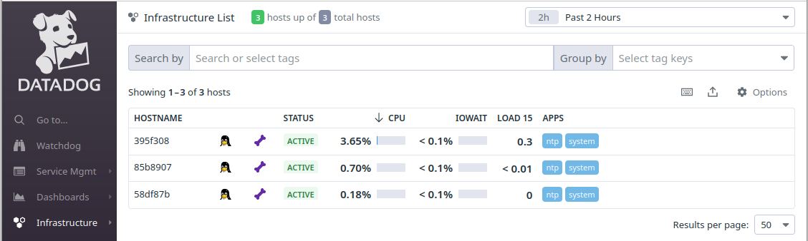

Datadog's [IoT Agent](https://docs.datadoghq.com/agent/iot) for device monitoring, packaged as a [balenaBlock](https://docs.balena.io/learn/develop/blocks/).

## Getting Started

1. Create an account at [Datadog](https://www.datadoghq.com) to generate an API key
1. Create a 'datadog-iot' service entry in your docker-compose, like [this example](https://github.com/balena-io-experimental/datadog-iot-block/blob/master/docs/example)
1. Set the generated API key as the value of a `DD_API_KEY` [variable](https://docs.balena.io/learn/manage/variables/) for your fleet

View your device infrastructure [list](https://app.datadoghq.com/infrastructure) like below.

